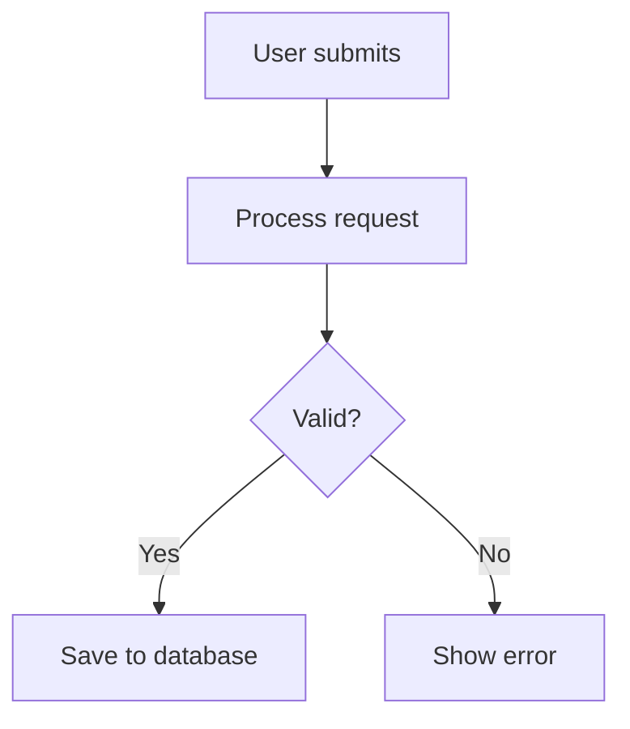

+++
updated = 2025-09-02T14:02:38+01:00
title = "Images & Media"
description = "How to add images, videos, and other media to the Meetball Handbook."
draft = false
weight = 60
template = "docs/page.html"

[extra]
lead = "Making your content visual with images, videos, and other media assets."
toc = true
top = false
+++

## Where to Put Images

All images go in the `static/` directory:

```
static/
├── images/           # General images
│   ├── screenshots/  # UI screenshots  
│   ├── diagrams/     # Architecture diagrams
│   └── icons/        # Small icons and graphics
├── videos/           # Video files (if needed)
└── docs/            # Documentation-specific assets
    └── guide-name/   # Images for specific guides
```

## Adding Images

### Basic Image
```markdown

```

### Image with Caption
```markdown

*How our system connects everything together*
```

### Responsive Image
For images that should scale on mobile:
```markdown

```

## Image Optimization

### Before Adding Images:
1. **Resize appropriately**: 1200px wide max for screenshots
2. **Compress**: Use tools like TinyPNG or ImageOptim
3. **Choose right format**:
   - `.png` for screenshots with text
   - `.jpg` for photos  
   - `.svg` for icons and simple graphics
   - `.webp` for best compression (if browser support is OK)

### Naming Convention
Use descriptive names:
```
✅ dashboard-main-view.png
✅ login-process-diagram.svg
❌ screenshot1.png  
❌ image.jpg
```

## Screenshots

### Taking Good Screenshots
- **Clean desktop**: Hide personal stuff from screenshots
- **Consistent browser**: Use same browser for all UI screenshots
- **Highlight important parts**: Use arrows or boxes to show what matters
- **High DPI**: Take screenshots on retina/high-DPI screens when possible

### Annotating Screenshots
Use tools like:
- **macOS**: Built-in screenshot markup
- **CleanShot X**: Great for annotations
- **Figma**: For creating diagrams and mockups

## Videos

### Embedding YouTube
```markdown
{{ youtube(id="dQw4w9WgXcQ") }}
```

This creates a responsive embed that works on all screen sizes.

### Local Video Files
Put in `static/videos/` and embed:
```html
<video controls style="max-width: 100%;">
  <source src="/videos/demo.mp4" type="video/mp4">
  Your browser doesn't support video.
</video>
```

## Icons & Graphics

### Using Existing Icons
Check what's already in `static/images/icons/` before adding new ones.

### Creating Consistent Graphics
- **Colors**: Use Meetball brand colors
- **Style**: Keep consistent with existing graphics  
- **Size**: Standard icon sizes (16px, 24px, 32px, 64px)

## Diagrams

### Mermaid (Preferred)
Use Mermaid for flow charts and diagrams:
````markdown

````

### Image Diagrams
For complex diagrams, create in:
- **Figma**: For UI mockups and flows
- **Draw.io**: For technical diagrams
- **Excalidraw**: For sketchy, informal diagrams

Save as `.svg` when possible for crisp scaling.

## File Size Guidelines

- **Screenshots**: Under 500KB each
- **Diagrams**: Under 200KB  
- **Icons**: Under 50KB
- **Videos**: Under 10MB (prefer YouTube embeds)

## Accessibility

Always include alt text:
```markdown

```

Make it descriptive for screen readers!

## Testing Images

Before committing:
1. **Test locally**: Run `zola serve` and check images load
2. **Check mobile**: Resize browser window to see how images scale
3. **Verify paths**: Make sure image paths are correct (start with `/`)

## Common Issues

### Image Not Showing?
- Check the path starts with `/` (like `/images/pic.png`)
- Make sure image is in `static/` directory
- Check file name spelling and case sensitivity

### Image Too Big on Mobile?
Add CSS:
```markdown

```

Remember: Good visuals make docs way more helpful! 📸
