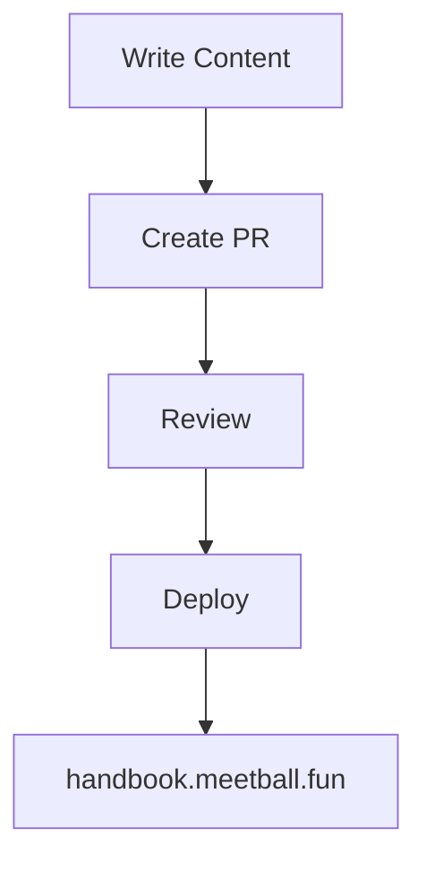

+++
title = "Markdown Guide"
description = "How to write awesome content with Zola's markdown features."
draft = false
weight = 40
template = "docs/page.html"

[extra]
lead = "Everything you need to know about writing content for the MeetBall handbook with Zola's markdown."
toc = true
top = false
math = true
+++

## Basic Markdown

All the usual markdown stuff works:

```markdown
# Big Title
## Smaller Title

**Bold text** and *italic text*

- Bullet points
- Are awesome
- For lists

1. Numbered lists
2. Work too
3. Obviously

[Links to stuff](https://meetball.fun) and `inline code`.
```


# Big Title
## Smaller Title

**Bold text** and *italic text*

- Bullet points
- Are awesome
- For lists

1. Numbered lists
2. Work too
3. Obviously

[Links to stuff](https://meetball.fun) and `inline code`.


## Code Blocks

Zola has syntax highlighting built-in. Just specify the language:

````markdown
```rust
fn main() {
    println!("Hello MeetBall!");
}
```

```javascript
const meetball = {
    awesome: true,
    handbook: "https://handbook.meetball.fun"
};
```

```bash
# Commands look good too
git clone https://github.com/thesummeet/handbook.git
zola serve
```
````


```rust
fn main() {
    println!("Hello MeetBall!");
}
```

```javascript
const meetball = {
    awesome: true,
    handbook: "https://handbook.meetball.fun"
};
```

```bash
# Commands look good too
git clone https://github.com/thesummeet/handbook.git
zola serve
```


## Front Matter

Every markdown file needs front matter at the top:

```toml
+++
title = "Your Page Title"
description = "Short description for SEO and previews"
draft = false
weight = 10  # Lower numbers appear first in navigation
template = "docs/page.html"  # or "blog/page.html" for blog posts

[extra]
lead = "A short intro paragraph that appears under the title"
toc = true   # Show table of contents
top = false  # Pin to top of section
+++
```

**This is what creates the page structure you see on this very page!** The front matter above would create a page with the title "Your Page Title" and all the settings configured.

## Zola Shortcodes

These are MeetBall handbook specific shortcuts:

### YouTube Embeds
Just grab the video ID from the YouTube URL:
- URL: `https://www.youtube.com/watch?v=qz0k5aa7Bpg`
- ID: `qz0k5aa7Bpg` (everything after `v=`)

In your markdown file, type:
```markdown
{{/* youtube(id="qz0k5aa7Bpg") */}}
```


{{ youtube(id="qz0k5aa7Bpg") }}


### GitHub Repository Links
Use the format `owner/repository`:

In your markdown file, type:
```markdown
{{/* github(repo="thesummeet/handbook") */}}
```


{{ github(repo="thesummeet/handbook") }}


### GitHub Repository Cards
For a more detailed view with repo stats:

In your markdown file, type:
```markdown
{{/* github_card(repo="thesummeet/handbook") */}}
```


<a href="https://github.com/thesummeet/handbook" target="_blank" rel="noopener" class="github-card" style="display: block; border: 1px solid #e6ddd4; border-radius: 12px; padding: 16px; margin: 16px 0; max-width: 400px; background: #fffef9; box-shadow: 0 1px 3px rgba(0,0,0,0.1); font-family: -apple-system, BlinkMacSystemFont, 'Segoe UI', sans-serif; text-decoration: none; color: inherit;">
  <div style="display: flex; align-items: center; margin-bottom: 8px;">
    <svg width="16" height="16" viewBox="0 0 16 16" fill="#6b4423" style="margin-right: 8px;">
      <path d="M8 0C3.58 0 0 3.58 0 8c0 3.54 2.29 6.53 5.47 7.59.4.07.55-.17.55-.38 0-.19-.01-.82-.01-1.49-2.01.37-2.53-.49-2.69-.94-.09-.23-.48-.94-.82-1.13-.28-.15-.68-.52-.01-.53.63-.01 1.08.58 1.23.82.72 1.21 1.87.87 2.33.66.07-.52.28-.87.51-1.07-1.78-.2-3.64-.89-3.64-3.95 0-.87.31-1.59.82-2.15-.08-.2-.36-1.02.08-2.12 0 0 .67-.21 2.2.82.64-.18 1.32-.27 2-.27.68 0 1.36.09 2 .27 1.53-1.04 2.2-.82 2.2-.82.44 1.1.16 1.92.08 2.12.51.56.82 1.27.82 2.15 0 3.07-1.87 3.75-3.65 3.95.29.25.54.73.54 1.48 0 1.07-.01 1.93-.01 2.2 0 .21.15.46.55.38A8.013 8.013 0 0016 8c0-4.42-3.58-8-8-8z"/>
    </svg>
    <span style="font-weight: 600; color: #d97706; font-size: 14px;">thesummeet/handbook</span>
  </div>
  <div>
    <p style="color: #6b4423; font-size: 12px; margin: 0 0 8px 0; line-height: 1.4;">MeetBall handbook - In portuguese: MeetarBola mãolivro</p>
    <div style="display: flex; align-items: center; font-size: 12px; color: #6b4423; gap: 16px;">
      <span style="display: flex; align-items: center; gap: 4px;">
        <svg width="12" height="12" viewBox="0 0 16 16" fill="currentColor">
          <path d="M8 .25a.75.75 0 01.673.418l1.882 3.815 4.21.612a.75.75 0 01.416 1.279l-3.046 2.97.719 4.192a.75.75 0 01-1.088.791L8 12.347l-3.766 1.98a.75.75 0 01-1.088-.79l.72-4.194L.818 6.374a.75.75 0 01.416-1.28l4.21-.611L7.327.668A.75.75 0 018 .25z"/>
        </svg>
        0
      </span>
      <span style="display: flex; align-items: center; gap: 4px;">
        <svg width="12" height="12" viewBox="0 0 16 16" fill="currentColor">
          <path d="M5 3.25a.75.75 0 11-1.5 0 .75.75 0 011.5 0zm0 2.122a2.25 2.25 0 10-1.5 0v.878A2.25 2.25 0 005.75 8.5h1.5v2.128a2.251 2.251 0 101.5 0V8.5h1.5a2.25 2.25 0 002.25-2.25v-.878a2.25 2.25 0 10-1.5 0v.878a.75.75 0 01-.75.75h-4.5A.75.75 0 015 6.25v-.878zm3.75 7.378a.75.75 0 11-1.5 0 .75.75 0 011.5 0zm3-8.75a.75.75 0 11-1.5 0 .75.75 0 011.5 0z"/>
        </svg>
        0
      </span>
      <span style="display: flex; align-items: center; gap: 4px;">
        <span style="width: 12px; height: 12px; border-radius: 50%; background-color: #c6538c; display: inline-block;"></span>
        SCSS
      </span>
    </div>
  </div>
</a>


These create responsive, accessible embeds automatically!

## Internal Links

Link to other handbook pages:

```markdown
[Quick Start Guide](../getting-started/quick-start.md)
[FAQ](/docs/help/faq/)
```


[Quick Start Guide](../getting-started/quick-start.md)
[FAQ](/docs/help/faq/)


## Images

Put images in `static/images/` and reference them like:

```markdown

```

## Callouts

Use blockquotes for important notes:

```markdown
> **Note:** This is something important you should know!

> **Warning:** Don't do this unless you know what you're doing.

> **Tip:** Pro tip for making things even more awesome.
```


> **Note:** This is something important you should know!

> **Warning:** Don't do this unless you know what you're doing.

> **Tip:** Pro tip for making things even more awesome.



## Math

If you need math formulas, we have KaTeX support:

```markdown
$ E = mc^2 $

$$
\int_{-\infty}^{\infty} e^{-x^2} dx = \sqrt{\pi}
$$
```


$$
E = mc^2
$$

$$
\int_{-\infty}^{\infty} e^{-x^2} dx = \sqrt{\pi}
$$


## Mermaid Diagrams

Great for showing workflows and architecture:

````markdown

````





## Writing Tips

- Keep it conversational (like you're explaining to a friend)
- Use "you" instead of "the user"
- Add emojis where it makes sense ✨
- Break up long text with headers and lists
- Test your markdown by running `zola serve` locally

Remember: we're building in the open, so make it helpful for everyone! 🚀
